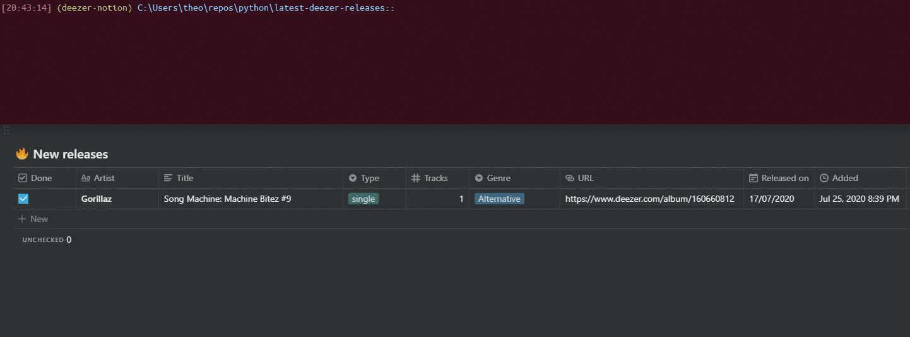

# latest-deezer-releases
Fetch the latest releases from my favorite Deezer artists and put them on a Notion.so page, using the [Deezer Python Client](https://github.com/browniebroke/deezer-python) and a [Python Notion.so API](https://github.com/jamalex/notion-py).

> :warning: This code is quite specific to my own needs, so use it at your own risk!

## What it does
It takes my favorite artists on Deezer and fetches their latest releases (7 days by default). Then, it puts them in a page in my Notion.so account, in which I have a ":fire: __New releases__" table. This code is automatically executed each week. Hopefully, I'll be kept up to date!



## How to use
After having cloned the repo and installed the requirements with `pip install -r requirements.txt`, make sure you have a __New releases__ table in Notion. Then you must add your Deezer `USER_ID`, Notion.so `TOKEN_V2` and `COLLECTION_URL` in `auth.py`, as explained [here](./auth.py). Finally:
```bash
# 7 days by default
python latest-deezer-releases.py
# custom period and time zone
python latest-deezer-releases.py -d 50 -u 1
```

> :pencil2: Note: You have to follow exactly this table structure, and for now, create the _select_ entries yourself.

| Done     | Artist | Title | Type   | Tracks | Genre  | URL | Released on | Added        |
|----------|--------|-------|--------|--------|--------|-----|-------------|--------------|
| Checkbox | Title  | Text  | Select | Number | Select | URL | Date        | Created time |
